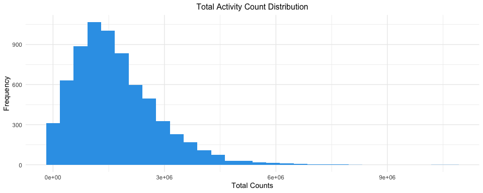
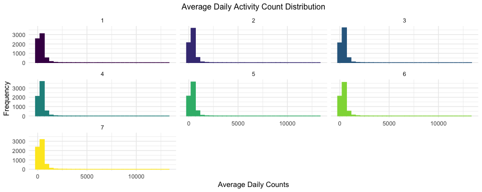
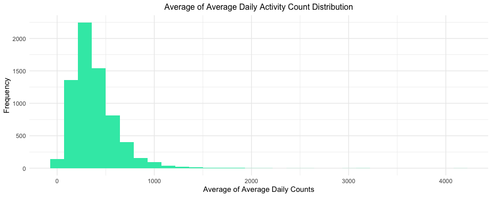

NHANES Activity Data Cleaning
================
Kevin S.W. — UNI: ksw2137
10/25/2020

# Activity Data Processing

Now that we’ve explored the variables, found out what each of them
represent, and selected for several variables of interest, we are ready
to go to the next step. That is to find any kind of correlation between
the variables. This step is important because we want our analysis to be
worthwhile, thus requiring that there is at least some correlation
between our variables of interest. The purpose of this section is to
obtain a smaller set of data from the activity dataset in `rnhanesdata`
package.

To obtain such “smaller” dataset, instead of keeping the dataset as
minute-by-minute, we will aggregate our data into total, daily average
as well as overall average obtained by averaging the daily average.

# Merging Activity Data and Flag Data

First, we need to re-arrange our activity data and make it less
cumbersome. The current plan is to aggregate all of the activity counts
into “daily counts”, thus making it easier to parse through.

``` r
library(rnhanesdata)

# turning original activity dataset into long format
activity_data_D <- PAXINTEN_D %>% 
  janitor::clean_names() %>% 
  pivot_longer(
    cols = starts_with("MIN"), 
    names_to = "min",
    names_prefix = "min",
    values_to = "activ_count") %>% 
  mutate(
    min = as.numeric(min)
    ) %>% 
  mutate_at(
    .vars = vars("seqn", "paxcal", "paxstat", "weekday", "sddsrvyr"),
    .funs = funs(factor)
    ) %>% 
  group_by(seqn)


# turning original flags dataset into long format
flag_data_D <- Flags_D %>% 
  janitor::clean_names() %>% 
  pivot_longer(
    cols = starts_with("MIN"), 
    names_to = "min",
    names_prefix = "min",
    values_to = "activ_count") %>% 
  mutate(
    min = as.numeric(min)
    ) %>% 
  mutate_at(
    .vars = vars("seqn", "paxcal", "paxstat", "weekday", "sddsrvyr"),
    .funs = funs(factor)
    ) %>% 
  group_by(seqn)


# combine both datasets so that each activity count is paired with its "flag status"
activity_flag_joined <- 
  left_join(
    activity_data_D, 
    flag_data_D, 
    by = c("seqn", "paxcal", "paxstat", "weekday", "sddsrvyr", "min")) 
```

# Obtaining Clean Datasets

Once the dataset has been merged, we now proceed to filter out the
dataset based on values that are reliable. In this particular case, we
filter so that `activity_flag`, `paxstat`, and `paxcal` = 1. This is
because 1 indicates that the tracking device are worn, reliable, and
calibrated.

## Total Activity Data

In this portion, we will obtain a total count of each survey
respondents.

``` r
# filtering dataset only on "reliable values"
filtered_activity_flag_joined <- activity_flag_joined %>% 
  rename(activity_count = activ_count.x,
         activity_flag = activ_count.y) %>% 
  filter(activity_flag == 1,
         paxcal == 1,
         paxstat == 1)

# obtain total activity count by subjects
total_activity_df <- filtered_activity_flag_joined %>% 
  group_by(seqn) %>% 
  summarize(total_count = sum(activity_count))

#total_activity_df %>% write_csv("./Datasets/total_activ_data.csv")

# plot distribution of counts
total_activity_df %>% 
  ggplot(aes(x = total_count)) +
  geom_histogram(fill = "#33A1E8") + 
  theme(legend.position = "none") +
  labs(title = "Total Activity Count Distribution",
       x = "Total Counts",
       y = "Frequency")
```



Once we filter it out, we can create a dataset out of this. For now, the
total activity per subject will suffice to explore some general
associations. If we need to obtain a more granular dataset, we could do
so with the datasets prior to filtering. Additionally, we could plot the
distribution of total activities. We see that the data is highly
right-skewed.

## Average Daily Activity Data

Below, we also would like to evaluate the average count of daily
activity. Similar steps are done except that we average the activity
values on survey respondents and week of the day.

``` r
# averaging the daily activity count for each subject
avg_activity <- filtered_activity_flag_joined %>% 
  group_by(seqn, weekday) %>% 
  summarize(avg_daily = mean(activity_count))

#avg_activity %>% write_csv("./Datasets/avg_daily_activ_data.csv")

# plotting distribution of daily average, faceted into the average frequency on each day
avg_activity %>% 
  ggplot(aes(x = avg_daily, color = weekday, fill = weekday)) +
  geom_histogram() + 
  theme(legend.position = "none") +
  facet_wrap(~weekday) + 
  labs(title = "Average Daily Activity Count Distribution",
       x = "Average Daily Counts",
       y = "Frequency")
```



## Average of Average Daily Activity Data

This is obtained by first obtaining the daily average and then averaging
it out further.

``` r
# taking an average out of the daily averages per survey respondents
grand_avg_activity <- avg_activity %>% 
  ungroup() %>% 
  group_by(seqn) %>% 
  summarize(grand_avg = mean(avg_daily))

#grand_avg_activity %>% write_csv("./Datasets/grand_avg_activ_data.csv")

# distribution plot of the average of average
grand_avg_activity %>% 
  ggplot(aes(x = grand_avg)) +
  geom_histogram(fill = "#33E8B4") + 
  theme(legend.position = "none") + 
  labs(title = "Average of Average Daily Activity Count Distribution",
       x = "Average of Average Daily Counts",
       y = "Frequency")
```


