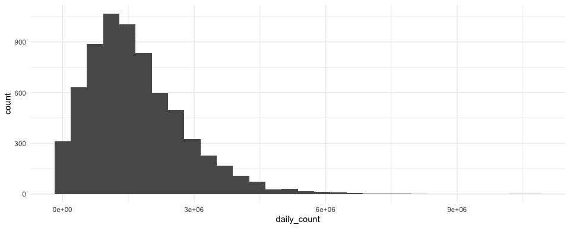

NHANES Data Cleaning
================
Kevin S.W. — UNI: ksw2137
10/10/2020

# Data Processing

Now that we’ve explored the variables, found out what each of them
represent, and selected for several variables of interest, we are ready
to go to the next step. That is to find any kind of correlation between
the variables. This step is important because we want our analysis to be
worthwhile, thus requiring that there is at least some correlation
between our variables of interest.

# Cleaning and Consolidating Activity Data

First, we need to re-arrange our activity data and make it less
cumbersome. The current plan is to aggregate all of the activity counts
into “daily counts”, thus making it easier to parse through.

### Loading dataset

``` r
library(rnhanesdata)

# turning original dataset into long format
activity_data_D <- PAXINTEN_D %>% 
  janitor::clean_names() %>% 
  pivot_longer(
    cols = starts_with("MIN"), 
    names_to = "min",
    names_prefix = "min",
    values_to = "activ_count") %>% 
  mutate(
    min = as.numeric(min)
    ) %>% 
  mutate_at(
    .vars = vars("seqn", "paxcal", "paxstat", "weekday", "sddsrvyr"),
    .funs = funs(factor)
    ) %>% 
  group_by(seqn)
```

    ## Warning: `funs()` is deprecated as of dplyr 0.8.0.
    ## Please use a list of either functions or lambdas: 
    ## 
    ##   # Simple named list: 
    ##   list(mean = mean, median = median)
    ## 
    ##   # Auto named with `tibble::lst()`: 
    ##   tibble::lst(mean, median)
    ## 
    ##   # Using lambdas
    ##   list(~ mean(., trim = .2), ~ median(., na.rm = TRUE))
    ## This warning is displayed once every 8 hours.
    ## Call `lifecycle::last_warnings()` to see where this warning was generated.

``` r
flag_data_D <- Flags_D %>% 
  janitor::clean_names() %>% 
  pivot_longer(
    cols = starts_with("MIN"), 
    names_to = "min",
    names_prefix = "min",
    values_to = "activ_count") %>% 
  mutate(
    min = as.numeric(min)
    ) %>% 
  mutate_at(
    .vars = vars("seqn", "paxcal", "paxstat", "weekday", "sddsrvyr"),
    .funs = funs(factor)
    ) %>% 
  group_by(seqn)


activity_flag_joined <- 
  left_join(
    activity_data_D, 
    flag_data_D, 
    by = c("seqn", "paxcal", "paxstat", "weekday", "sddsrvyr", "min")) 

activity_flag_joined <- activity_flag_joined %>% 
  rename(activity_count = activ_count.x,
         activity_flag = activ_count.y) %>% 
  filter(activity_flag == 1)

total_activity_df <- activity_flag_joined %>% 
  group_by(seqn, paxcal, paxstat) %>% 
  summarize(daily_count = sum(activity_count))
```

    ## `summarise()` regrouping output by 'seqn', 'paxcal' (override with `.groups` argument)

``` r
total_activity_df <- total_activity_df %>% 
  filter(paxcal != 2,
         paxstat != 2)
  
total_activity_df %>% 
  ggplot(aes(x = daily_count)) +
  geom_histogram()
```

    ## `stat_bin()` using `bins = 30`. Pick better value with `binwidth`.


