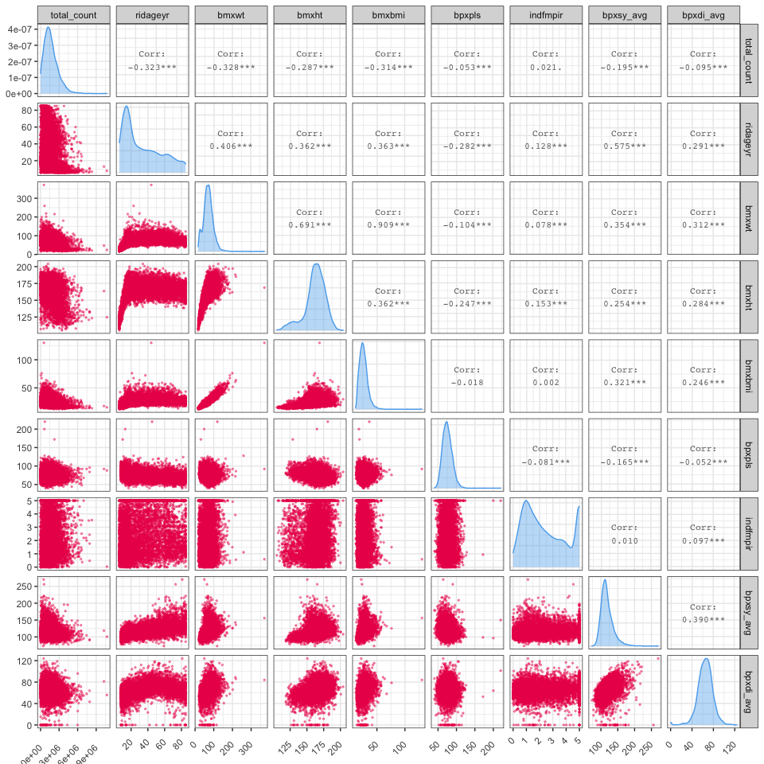

NHANES Consolidated Data EDA
================
Kevin S.W. — UNI: ksw2137
11/17/2020

# Exploration on Filtered, Consolidated Datasets

Now that we’ve explored the codebook, covariates dataset, and the
activity dataset, we can now proceed to merging our covariate dataset
and activity dataset.

## Merging Datasets

We first merge our covariate dataset with the total activity count
dataset. We should also change the data type to their corresponding
variable. Details on the non-numeric variables can be found
[here](#re-categorizing-data-types).

Since we’ve isolated our dataset, we should also remove several
variables that have now became irrelevant.

``` r
total_activity_df <- read_csv("./Datasets/total_activ_data.csv") %>% 
  janitor::clean_names() %>% 
  mutate(
    seqn = as_factor(seqn)
  )


covar_df <- read_csv("./Datasets/covariates.csv") %>% 
  janitor::clean_names() %>% 
  mutate(
    seqn = as_factor(seqn)
  )


merged_df <- inner_join(total_activity_df, covar_df, by = "seqn") %>% 
  mutate_at(
    .vars = vars("ridstatr", "riagendr", "ridreth1", "alq120u", "peascst1", "bpxpuls", "dmdeduc2", "dmdeduc3", "indfminc", 
                 "diq010", "diq220", "diq160", "diq170", "diq190a", "diq190b", "diq190c", "diq200a", "diq200b", "diq200c", 
                 "diq050", "mcq080", "mcq160b", "mcq160c", "mcq160d", "mcq160e", "mcq160f", "mcq160g", "pfq020", "smq040", 
                 "smq050u"),
    .funs = funs(factor)
  ) %>% 
  select(-sddsrvyr)
```

We should also import our codebook just in case we need to look back on
which variable is which.

``` r
codebook_df <- read_csv("./Datasets/variable_list.csv") %>% 
  filter(str_detect(var_name, paste(names(merged_df), collapse = "|")))
```

## Converting and/or Removing “NA” values

Per CDC’s codebook, certain variables contain numbers such as “77” or
“99” or “99999” to indicate that respondents either refused to provide
information or they don’t know. As such, we should treat these values as
`NA`s since these values does not add any information to our data. We
will either remove or convert these values so that our variable
distribution is more reflective of the relevant datapoints.

First, removing those with large amounts of NA values and likely not
“relevant” to our interest.

`ridstatr` is removed as this was an indicator between interview only
vs. interview + exam. Based on our summary results, all datapoints
received interview + exam.

``` r
remove_list <- c("ridstatr", "bmxwaist", "diq160", "diq170", "diq190", "diq220", "mcq080", "mcq160", "pfq020", "mcq180", "smq040", "smq050", "alq120", "dmdeduc")

new_merged_df <- select_if(merged_df, 
                       !str_detect(names(merged_df), paste(remove_list, collapse = "|"))
                       )

skimr::skim(new_merged_df)
```

|                                                  |                 |
| :----------------------------------------------- | :-------------- |
| Name                                             | new\_merged\_df |
| Number of rows                                   | 6851            |
| Number of columns                                | 20              |
| \_\_\_\_\_\_\_\_\_\_\_\_\_\_\_\_\_\_\_\_\_\_\_   |                 |
| Column type frequency:                           |                 |
| factor                                           | 11              |
| numeric                                          | 9               |
| \_\_\_\_\_\_\_\_\_\_\_\_\_\_\_\_\_\_\_\_\_\_\_\_ |                 |
| Group variables                                  | None            |

Data summary

**Variable type: factor**

| skim\_variable | n\_missing | complete\_rate | ordered | n\_unique | top\_counts                       |
| :------------- | ---------: | -------------: | :------ | --------: | :-------------------------------- |
| seqn           |          0 |           1.00 | FALSE   |      6851 | 311: 1, 311: 1, 311: 1, 311: 1    |
| riagendr       |          0 |           1.00 | FALSE   |         2 | 2: 3561, 1: 3290                  |
| ridreth1       |          0 |           1.00 | FALSE   |         5 | 3: 2718, 4: 1859, 1: 1744, 5: 327 |
| peascst1       |          0 |           1.00 | FALSE   |         3 | 1: 6597, 3: 195, 2: 59            |
| bpxpuls        |        214 |           0.97 | FALSE   |         2 | 1: 6464, 2: 173                   |
| indfminc       |         57 |           0.99 | FALSE   |        15 | 11: 1450, 6: 877, 7: 682, 8: 619  |
| diq010         |          0 |           1.00 | FALSE   |         4 | 2: 6350, 1: 411, 3: 85, 9: 5      |
| diq200a        |        964 |           0.86 | FALSE   |         3 | 2: 3476, 1: 2406, 9: 5            |
| diq200b        |        964 |           0.86 | FALSE   |         3 | 2: 3501, 1: 2382, 9: 4            |
| diq200c        |        964 |           0.86 | FALSE   |         3 | 2: 3565, 1: 2317, 9: 5            |
| diq050         |          0 |           1.00 | FALSE   |         2 | 2: 6724, 1: 127                   |

**Variable type: numeric**

| skim\_variable | n\_missing | complete\_rate |       mean |         sd |     p0 |       p25 |        p50 |        p75 |        p100 | hist  |
| :------------- | ---------: | -------------: | ---------: | ---------: | -----: | --------: | ---------: | ---------: | ----------: | :---- |
| total\_count   |          0 |           1.00 | 1680831.93 | 1124853.67 | 249.00 | 880538.00 | 1490398.00 | 2262961.00 | 10735330.00 | ▇▃▁▁▁ |
| ridageyr       |          0 |           1.00 |      33.64 |      22.59 |   6.00 |     15.00 |      26.00 |      51.00 |       85.00 | ▇▃▃▂▂ |
| bmxwt          |         16 |           1.00 |      70.70 |      25.64 |  16.20 |     54.65 |      70.00 |      85.30 |      371.00 | ▇▂▁▁▁ |
| bmxht          |         17 |           1.00 |     162.25 |      15.31 | 105.20 |    155.50 |     164.00 |     172.40 |      204.10 | ▁▂▇▇▁ |
| bmxbmi         |         28 |           1.00 |      26.16 |       7.35 |  11.98 |     20.96 |      25.31 |      30.17 |      130.21 | ▇▁▁▁▁ |
| bpxpls         |        507 |           0.93 |      75.32 |      12.94 |  40.00 |     66.00 |      74.00 |      84.00 |      220.00 | ▇▆▁▁▁ |
| indfmpir       |        291 |           0.96 |       2.47 |       1.59 |   0.00 |      1.09 |       2.11 |       3.85 |        5.00 | ▇▇▅▅▇ |
| bpxsy\_avg     |        571 |           0.92 |     117.96 |      18.26 |  73.00 |    106.00 |     114.67 |     126.67 |      270.00 | ▇▇▁▁▁ |
| bpxdi\_avg     |        571 |           0.92 |      64.75 |      14.10 |   0.00 |     56.67 |      65.33 |      73.33 |      124.00 | ▁▁▇▂▁ |

## Evaluating associations

We first evaluate using correlation plot for all the numeric variables
to look for

``` r
matrix_plot <- new_merged_df %>% 
  select_if(is.numeric) %>% 
  ggpairs(
      lower = list(
        continuous = wrap(ggally_points, 
                          color = "#EC0557", alpha = 0.4, size = 0.5)),
      diag = list(
        continuous = wrap(ggally_densityDiag, 
                          color = "steelblue2", fill = "steelblue2",alpha = 0.4)),
      upper = list(
        continuous = wrap(ggally_cor, size = 3)
      )
      ) + 
  theme_bw() +
  theme(axis.text.x = 
          element_text(hjust = 1, vjust = 0.5,
                       angle = 45),
        plot.caption = element_text(hjust = 0, size = 8)
        )

matrix_plot
```



We also utilized GLM to check any kinds of association with all the
variables.

``` r
saturated_model <- new_merged_df %>% 
  glm(diq010 ~ . -diq010 -seqn, family = binomial, data = ., na.action = na.omit)

summary(saturated_model)
```

    ## 
    ## Call:
    ## glm(formula = diq010 ~ . - diq010 - seqn, family = binomial, 
    ##     data = ., na.action = na.omit)
    ## 
    ## Deviance Residuals: 
    ##     Min       1Q   Median       3Q      Max  
    ## -3.3168   0.0743   0.1342   0.2853   2.9355  
    ## 
    ## Coefficients:
    ##               Estimate Std. Error z value Pr(>|z|)    
    ## (Intercept) -5.176e+00  5.217e+00  -0.992  0.32112    
    ## total_count  1.245e-07  9.685e-08   1.285  0.19862    
    ## riagendr2    1.042e-01  2.009e-01   0.519  0.60399    
    ## ridageyr    -6.218e-02  5.072e-03 -12.259  < 2e-16 ***
    ## ridreth12   -2.208e-01  3.828e-01  -0.577  0.56398    
    ## ridreth13    1.052e+00  2.085e-01   5.045 4.53e-07 ***
    ## ridreth14    1.751e-01  2.126e-01   0.823  0.41032    
    ## ridreth15    2.676e-01  3.960e-01   0.676  0.49914    
    ## bmxwt       -4.930e-02  2.780e-02  -1.773  0.07624 .  
    ## bmxht        4.524e-02  2.989e-02   1.514  0.13012    
    ## bmxbmi       9.935e-02  7.856e-02   1.265  0.20602    
    ## peascst12    1.120e+01  8.827e+02   0.013  0.98988    
    ## bpxpls      -1.573e-02  5.777e-03  -2.723  0.00646 ** 
    ## bpxpuls2     3.608e-01  3.254e-01   1.109  0.26755    
    ## indfminc2   -1.809e+00  1.021e+00  -1.772  0.07639 .  
    ## indfminc3   -1.281e+00  1.019e+00  -1.257  0.20884    
    ## indfminc4   -1.946e+00  1.014e+00  -1.919  0.05500 .  
    ## indfminc5   -1.892e+00  1.018e+00  -1.859  0.06304 .  
    ## indfminc6   -2.071e+00  1.019e+00  -2.032  0.04218 *  
    ## indfminc7   -2.388e+00  1.040e+00  -2.296  0.02169 *  
    ## indfminc8   -2.629e+00  1.062e+00  -2.475  0.01331 *  
    ## indfminc9   -2.671e+00  1.104e+00  -2.419  0.01555 *  
    ## indfminc10  -2.079e+00  1.161e+00  -1.791  0.07324 .  
    ## indfminc11  -2.744e+00  1.128e+00  -2.433  0.01497 *  
    ## indfmpir     3.087e-01  1.187e-01   2.601  0.00930 ** 
    ## diq200a2     5.730e-01  1.904e-01   3.009  0.00262 ** 
    ## diq200a9     1.207e+01  8.827e+02   0.014  0.98909    
    ## diq200b2    -5.559e-02  1.697e-01  -0.328  0.74322    
    ## diq200b9    -9.192e+00  1.343e+03  -0.007  0.99454    
    ## diq200c2     9.682e-01  1.951e-01   4.962 6.97e-07 ***
    ## diq200c9     1.019e+01  8.827e+02   0.012  0.99079    
    ## diq0502      6.782e+00  7.893e-01   8.592  < 2e-16 ***
    ## bpxsy_avg   -5.975e-03  3.794e-03  -1.575  0.11531    
    ## bpxdi_avg    5.484e-04  5.039e-03   0.109  0.91334    
    ## ---
    ## Signif. codes:  0 '***' 0.001 '**' 0.01 '*' 0.05 '.' 0.1 ' ' 1
    ## 
    ## (Dispersion parameter for binomial family taken to be 1)
    ## 
    ##     Null deviance: 2616.2  on 5380  degrees of freedom
    ## Residual deviance: 1526.7  on 5347  degrees of freedom
    ##   (1470 observations deleted due to missingness)
    ## AIC: 1594.7
    ## 
    ## Number of Fisher Scoring iterations: 13

# Re-categorizing Data Types

Now that we’ve minimized our covariates further, we can then begin
selecting which ones are `factor` vs. `numeric`. These are the variables
which are non-numeric (i.e. `factor`s or any other special formats):

  - `seqn`: identifier for survey respondents
  - `ridstatr`: interview + exam status.  
    1 = interview only  
    2 = interview + exam  
  - `riagendr`: Gender.  
    1 = male  
    2 = female  
  - `ridreth1`: Ethnicity/race.  
    1 = Mexican American  
    2 = Other Hispanic  
    3 = Non-Hispanic White  
    4 = Non-Hispanic Black  
    5 = Other (incl. multi-racial)  
  - `alq120q`: `numeric` but some values should be noted as `factor`
    0-365 as range of values  
    777 = refused  
    999 = don’t know  
  - `alq120u`: units for `alq120q`  
    1 = per week  
    2 = per month  
    3 = per year  
    7 = refused  
    9 = don’t know  
  - `peascst1`: BP measure status.  
    1 = complete  
    2 = partial  
    3 = not done  
  - `bpxpuls`: quality of pulse  
    1 = regular  
    2 = irregular  
  - `dmdeduc2`: education level of adults 20+ yrs  
    1 = Less Than 9th Grade  
    2 = 9-11th Grade (Includes 12th grade with no diploma)  
    3 = High School Grad/GED or Equivalent  
    4 = Some College or AA degree  
    5 = College Graduate or above  
    7 = Refused  
    9 = Don’t Know  
  - `dmdeduc3`: education level of children 6-19 yrs  
    0 = Never Attended / Kindergarten Only  
    1 = 1st Grade  
    2 = 2nd Grade  
    3 = 3rd Grade  
    4 = 4th Grade  
    5 = 5th Grade  
    6 = 6th Grade  
    7 = 7th Grade  
    8 = 8th Grade  
    9 = 9th Grade  
    10 = 10th Grade  
    11 = 11th Grade  
    12 = 12th Grade, No Diploma  
    13 = High School Graduate  
    14 = GED or Equivalent  
    15 = More than high school  
    55 = Less Than 5th Grade  
    66 = Less Than 9th Grade  
    77 = Refused 0 3431  
    99 = Don’t know 1 3432  
  - `indfminc`: annual family income bracket  
    1 = $ 0 to $ 4,999  
    2 = $ 5,000 to $ 9,999  
    3 = $10,000 to $14,999  
    4 = $15,000 to $19,999  
    5 = $20,000 to $24,999  
    6 = $25,000 to $34,999  
    7 = $35,000 to $44,999  
    8 = $45,000 to $54,999  
    9 = $55,000 to $64,999  
    10 = $65,000 to $74,999  
    11 = $75,000 and Over  
    12 = Over $20,000  
    13 = Under $20,000  
    77 = Refused  
    99 = Don’t know  
  - `diq010`: Told by doctor to have diabetes
  - `diq220`: days?
  - `diq160`: Told by doctor to have pre-diabetes
  - `diq170`: Told by doctor to have health risk of diabetes
  - `diq190a`: Told by doctor to control weight
  - `diq190b`: Told by doctor to increase physical activity
  - `diq190c`: Told by doctor to reduce calorie intake
  - `diq200a`: Is the subject controlling weight
  - `diq200b`: Is the subject increasing physical activity
  - `diq200c`: Is the subject reducing caloric intake
  - `diq050`: Is subject taking insulin currently
  - `mcq080`: Told by doctor as overweight
  - `mcq160*`: Presence of cardiac-related history
      - `b`: CHF
      - `c`: CHD
      - `d`: angina/angina pectoris
      - `e`: MI
      - `f`: Stroke
      - `g`: emphysema
  - `pfq020`: impairment/health problem that limits ability to
    crawl/walk/run/play
  - `smq040`: Is subject currently smoking cigarettes
  - `smq050u`: Units of measure for `smq050q`, which is an integer for
    “if not smoking, how long since subject last smoked”.
